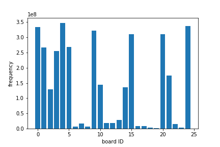

## Structure

```
GoStone --> GoBlock -> GoBoard
```

The game board, `GoBoard` are consists of `GoBlock`s, and `GoBlock` is consist of `GoStone`s.

I do static allocation of `GoBlocks` and `GoStone` per `GoBoard`.

`GoState` is the interface to react between the saved states. 

## Zobrist Hash

The Z-Hash is used to check if the board position is repeated. In our small board analysis, Positional SuperKo is allowed, meaning that we only have to check whether there is a Ko in our move to determine whether the move is legal.

The Z-Hash is initially generated using `GoFunction::CreateZobristHash`, with fixed `uint32_t seed = 0xdeadbeef;`. We prepare Z-Hash for the every possible stone of appearance on the board, which includes "Empty"(0), "Black"(1), "White"(2).

## 1st Phase: Find all legal & reduced serial

Find all "legal & reduced" serial numbers for the given board size.

This phase I created a constructor that takes serial numbers in. It calles `GoBoard::SetStone` to place the stones onto the board without maintaining gaming details of the board. (so it is a modification version of `GoBoard::Move`). If anything eat or self-eat move happens when `SetStone`, the construction will end and the for-loop in `FindAllPossibleSerial/main.cpp` will go on to try the next serial number.

### Remarks

Actually not that many function is related in this phase, because I only want to initialize the board. However the correctness of this phase also have asserted that `GoBlock` and `GoStone` maintenance is **bug-free**.

### Psuedo Code

- For all possible `serial`...
	- `GoBoard(serial)`
		- Calls `SetStone` for each stone on the `serial`, which the `GoStone` is on position `id`
			- Create a new `GoBlock`
			- Get neighboring `GoBlocks` of `id` using `GetNeighborBlocks`
				- `GetNeighborBlocks` calls `GetBlockIdByCoord` for each neighboring position
					- `GetBlockIdByCoord` calls `FindCoord`, which stones are herded together using **disjoint-set**
			- If neighboring block is of the same color, call `GoBlock::TryMergeBlock`
			- If neighboring block is opponent and with only 1 liberty left, the construction fails (**ERROR CODE -2**)
			- If the merged block of my own have no liberty, then the construction fails (**ERROR CODE -1**)
			- After `GoBlock::MergeBlock`, use `GoBoard::RecycleBlock` to recycle the blocks.
	- If construction does not fail, we try `RotateClockwise` and do once `FlipLR` for every rotation.
		- If `GetSerial` returns numbers that is smaller than the current `serial`, then is should be reduce-able.
	- If it is not reduce-able, then we acccumulate an `1` bit onto the file
	- Else we accumulate a `0` bit onto the file.


### Generating Data

By the master thesis, there are about `414.2G` of states in a `5x5` board. I would save the 1 bit per state

- If legel, an `1` bit will be appended
- else , a `0` bit will be appended.

`48.1G` byte needed to save all the legal states.

## 2nd Phase: Find all possible Ko position

Taking the data generated from the previous phase, this part I would still generate data in a sparse manner. Meaning
that for a illegal serial (represented as a `0` bit in 1st phase data), I would still output 4 bytes full zero for the
serial number.

For a serial number, 4 bytes are used to record its possible Ko position. (LSB style) Meaning that if you fetch
`uint32_t x` representing for this serial number, then `((x>>(id))&1) == 1` means that on position `id` there can be a
Ko.

Also note that boards now all represent as a state where it is the black's turn. So for the checking I will view on
available white blocks on the board.

### Remarks

Ko mainly distribute on corners or border lines.

#### 5x5



### Psuedo Code

- For all legal `serial` (decoded from data saved in previous phase)
	-  For all position of `serial` (saved in 32 bit)
		-  If there is a ko position for this stone's neighbor
		-  Set neighbor to a possible ko position
	- Write the 32 bit into buffer
- When buffer is full, write to file

### Generating Data

For each position, generate 32 bit record the ko positions. The `0th` bit (least bit) represents for position `id = 0`. Checkout the data splitting in `result/5x5.log` for argument setting of next phase.
