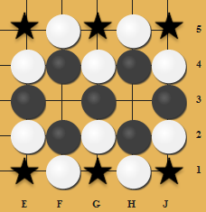
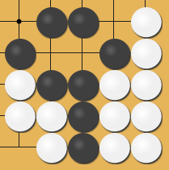

## 2019/11/06

Before the starting date I have read the master thesis "Memory efficient algorithms and implementations for solving small-board-sized Go". The program of this thesis works correctly but rather inefficient and have space for improvement.

I will implement a efficient and succint program on calculating small boards of Go for further usage of Monte-Carlo or Neural Network.

## 2019/11/08

The class hierarchy and methods are developed with me learning from [PheonixGo](https://github.com/Tencent/PhoenixGo/), which is an implementation on `AlphaGo Zero` and the paper "Mastering the Game of Go without Human Knowledge". Tracing through the repository may help you to understand my code.

## 2019/11/20

I have finished works of being a Teaching Assistant of "Theory of Computer Game".(prepare midterm exam) This has been an inproductive 10 days for me. Since I have now gotton the image that there is massive workload waiting for me, that I may write up to 4000 lines of code to implement this SmallBoard Experiment.

Now I need to keep-on the trace and implementation.

以上廢話，接下來進入正題⋯⋯

- since the experiment allows superko, we only need to check if the the move violates **_"Basic Ko"_**, so we don't need unorder_map to record, but rather a game history of length 4. 這裡選長度為 4 是因為這樣 access 時，做同餘可以用 bit operation 代替。

- PheonixGo 中 GoState 含有若干個 GoBlock ，並且可以 reuse 。

```
once_flag CreateGlobalVariables_once;
void CreateGlobalVariables() {
    call_once(
        CreateGlobalVariables_once,
        []() {
            CreateNeighbourCache();
            CreateHashWeights();
            CreateQuickLog2Table();
            CreateZobristHash();
        }
    );
}
```

- 上面這段 code 中 `once_flag` 加上 `call_once` 保證以下這些 function 只被呼叫一次。以下四個 `CreateXXX` 是在 `go_comm.h` 中被定義的全域變數。這個技巧可以應用在之前的 `SuccinctWT` 來調整程式的可讀性 

- 最重要的是要記住為什麼我需要重寫 SmallBoard ，要增加編碼的 locality ，所以需要調查有無 Ko 的情況下盤面的分佈。

- 估計這應該一個月可以完成。

- 在 `GoState::GetSensibleMove` 中，進行一個 move (placing a new stone) 代表潛在 GoBlock 的增加

- `g_neighbour_cache_by_id` 是預處理該 id 四個方位的鄰居的相應 id ，省去每次搜過去鄰居時都需要的計算

## 2019/11/21

繼續幹！

### comm

`comm.h` is the shall be the first to be defined.

- 首先要完成的是 `comm.h/comm.cc` 這兩個檔案。
- 裡頭定義了一些預處理，只會處理一次的東東，像是 Zobrist Hash 中會用到的固定 hash 值，以及預先計算好的 id 所對應的 neighbor 的 id ，或是盤面上 (x, y) 所會有的 neighbor (x, y)。
- 另外還有一些簡易的 utility function ，會在標頭檔中含有補充說明。

- `cached_neighbor` 中並不是 [0]~[3] 依照四個方位，而是 compact 的，也就是搞不好只有 2 個或 3 個方位 available 。接下來對 neighbor 的詢問不需要再去判邊界。這也是為什麼有 `cached_neighbor_size` 來記錄總共有幾個在界內的方位。

### timer

the class `Timer` us constructed to measure performance.

## 2019/11/22

##### Finished basic structure on `comm`.

Notable

- Error logger - elog()
- GoBitState: The structure associates I/O with disk. Information stored 
	  compact and MSB style.
- GoConstant: Type definitions of variables, and constants of the board,
	  including the SmallBoard size.
- GoFunction: Utility functions for some judgement on the board. Also 
	  there are preprocessed tables used for Zobrist Hash and precalculated
	  table that corresponds (id/coordinate) to its neighbor (id/coordinate).
	  
`timer` also done.


##### Finish basic structure of GoBlock

Notable

- ❗️ if `SMALLBOARDSIZE` exceeds `64`, then there will be modification needed on bitstate storage of stone and liberty


## 2019/11/24

Measured performance on basic bit operation. I have to admit that the overhead is not as huge as expected when I concatenate the two operations in one code. The overhead seems to be small enough to emit... **_Maybe it will show greater difference when I aggregate the operation to more complicate structure._**

The `GoBitState` can be established now since I have done the experiment.

Also I started to build the move generation on `GoBoard`. The main operation is the move generation of the Board. To build the move generation, I hence found out that `GoStone` structure is crucial because I need to know which `GoBlock` this stone belongs to. This means that I need to do a report on the structure on how much space a `GoBoard` takes.

The move generation relies on the maintenance of **liberty(氣)**, which is maintained by `GoBlock`.

For a stone to be placed on some position on the board, it first check on its neighboring blocks to see whether it is an illegal move (如果那個地方下下去的話是會被吃的動作，就不能動那邊，所以要知道 neighbor block 是屬於誰的，要知道 neighbor block 資訊，這個 block 中含有的 stone 有哪些就也必須知道) 在實作的過程中一路往最底層蓋...

- 原本要蓋的是 move generation 函數: `TryMove`
- 因為要知道相鄰的 `GoBlock` 所以需要函數: `GetNeighborBlocks`
- 因為要知道這個 `GoBlock` 的 `GoBlockId`，所以需要函數: `GetBlockIdByCoord`
- 對這個 `GoBlock` 我需要知道他是誰，這個資訊被記錄在 ancestor stone （因為 stone 以 linked-list 的形式記錄起來) 所以需要函數: `FindCoord`

#### Notable ToDo

- [ ] Do measurement on `GoState` performance

- [ ] Do report on space on `GoBoard`

## 2019/11/25

Notable

- since i have id numbered from $[0, R \times C)$, so a board with no Ko will have `ko_position = R*C`, `pass_count = 0`.
- GoScore is unsigned integer with its range from $[0, 2 \times R \times C]$, where $R \times C$ represents $0$ and $0$ represents black loses the most... $-R \times C$

#### Compilation

- comm

```
g++ -std=c++11 -D ROW=5 -D COL=5 -c comm.cc
```

This compiles `comm.h` into object file that is link-able when we are going to compile an executable.

Today I am implemeting `GoState`, the structure to interact disk I/O.

I face 2 decisions, whether to do it in `bitset` or `uint64_t`. Let me list out the Pros and Cons...

##### `std::bitset`

Strength:

- compact, saves memory

Weakness:

- encode/decode goes through for-loop
- `reset` of a `std::bitset` is called by sending a pointer of the bitset to `memset`.
- need to transfer `bitset` to `uint64_t` when sorting.

##### `uint64_t`

Strength:

- sortState does not need to go through a transformation from `std::bitset`

Weakness:

- overhead of the extra memories (take example of 5x5 smallboard, the overhead is 7/64 ~ 10%)

##### 小結：在不同的 stage 使用不同的 GoState 感覺並不衝突。所以到時因應需求來使用需要的 GoState.


#### parameters I specified in `makefile`

- `ROW`: column of the board
- `COL`: row of the board
- `ENCODE_LENGTH`: the encoding length that can be calculated via easy math.

今天把 GoState 蓋好了！算是生產力不錯？XD 接下來就繼續蓋 `TryMove` ，目標是明天把 `TryMove` 完成。

把 `TryMove` 完成之後可以開始進行 SmallBoard 實驗的，在蓋實驗的過程中應該就會知道需要再多補充哪些函數了。

## 2019/11/26

今天要把 `TryMove` 還有 `GetPossibleMove` 完成。突然想到，在做 Retrograde Analysis 的時候，需要有 `GetPossibleParent`。

值得注意的是，

- `GoBoard::GetNeighborBlocks`，這個函數是要幫一個 `blk` 以及 `target_id` 來取得 `target_id` 周圍的 `GoBlock` ，這個函數也會在 `blk` 中的 stone_state 在 `target_id` 的位置加上一顆石頭。
- 如果 neighbor_block 只剩一個氣，然後我下在那裡就表示我把對方吃掉了，這樣我的 block 連在一起的東東也增加了。

剛剛做完 possible move generation ，接著做 actual moving ，然後再來是跟 GoState 之間的互動。

每個 `GoBoard` 裡面有 `SMALLBOARDSIZE` 這麼多個 `GoStone`， 石頭是用 Circular linked-list 串連起來的。然後 head 被記在 `GoBlock` 裡頭。

#### `GoBoard::Move`

`GoBoard::Move` 跟 `GoBoard::TryMove` 很像。

因為已經判斷出有哪些是合法的走步了，所以只要實際的把 board detail 做改變即可。其中複雜度很高的部分，是會把對方的 `GoBlock` 吃掉，而這部分對吃掉的 Block 需要看這個 Block 裏頭每個 stone 的 neighbor 是否含有友方 block ，如果是友方 block 的話需要更新他的 liberty 狀態。（見下方 code segment）

```
for ( GoBlockId i=1; i<=die_id[0]; ++i ) {
	if ( 1 == block_pool[die_id[i]] and 1 == blk.stone_count 
	 and 1 == blk.CountLiberty() ) {
	// this is a Ko!
		ko_position = block_pool[die_id[i]].head;
	}
	// for the stones of the killed GoBlock...
	FOR_BLOCK_STONE(dead_stone, block_pool[die_id[i]], 
		// for the neighbor of the stones
		FOR_NEIGHBOR(dead_stone, nb) {
			// if the neighbor is my color, add liberty to my stone
			if ( SelfColor() == board_state[*nb] ) {
				GoBlockId my_blk_id = GetBlockIdByCoord(*nb);

				visited_position[my_blk_id] = game_length;
				block_pool[my_blk_id].SetLiberty(dead_stone);
			}
		}
		board_state[dead_stone] = EmptyStone;
		current_zobrist_value ^= 
		 zobrist_board_hash_weight[OpponentColor()][dead_stone];
	);
	RecycleBlock(die_id[i]);
}
```

#### Notable ToDo

- [ ] `GetPossibleParent`


#### Interesting finding

##### Is it meanful to optimize swap?

CPU speeds compared to memory speeds have risen astronomically. Accessing memory has become the major bottleneck in application performance. All the swap algorithms will be spending most of their time waiting for data to be fetched from memory. Modern OS's can have up to 5 levels of memory:

- Cache Level 1 - runs at the same speed as the CPU, has negligible access time, but is small
- Cache Level 2 - runs a bit slower than L1 but is larger and has a bigger overhead to access (usually, data needs to be moved to L1 first)
- Cache Level 3 - (not always present) Often external to the CPU, slower and bigger than L2
- RAM - the main system memory, usually implements a pipeline so there's latency in read requests (CPU requests data, message sent to RAM, RAM gets data, RAM sends data to CPU)
- Hard Disk - when there's not enough RAM, data is paged to HD which is really slow, not really under CPU control as such.


##### 繼續寫進度⋯⋯

今天也順便完成了 `GoBoard` 的 constructor, destructor, 還也 copy constructor.


## 2019/11/27

今天開會討論到 BitState 的編碼，原本的編碼是 58 bit，但是其中 ko position 可以拆開來做，一個 serial number 最多不會有太多 ko （至多 6 個）因此在 ko position 的 bitstate 儲存方面可以思考其他的變化。

### Explanation on saving states containing Ko

一個盤面是以一個 serial number 來表示。一個盤面也可能同時在多個地方有 Ko 。在這裏的討論我們如果只關心 SerialNumber 還有 KoPass 的記錄。

#### Ko in master thesis

對一個盤面，假設這個盤面有 $k$ 種合法 Ko 位置，則碩論裡頭就會儲存 $k$ 個 BoardState 。這樣的花費是：

- $k \times $ (40 + log2(`BOARDSIZE+2`)) bit 

#### Space for Improvement

這裏學長他把 KoPass 綁在一起了，可是這樣其實很浪費，因為這樣等於是重複的記錄了 Serial 的部分。

當然在 KoPass 的值不一樣時...Degree, Game-Result, Score 也會不一樣，不過可以避免重複的方法就是把 KoPass 作為一個 object 抽出來。

#### Withdraw KoPass as an Object

好處：

- 省掉重複記錄 serial

壞處：

- linkage from serial number to its corresponding KoPass informations (這裏牽涉到 memory access ，因此 KoPass 的儲存也需要好好考慮）

KoPass 抽出來作為物件最簡單有兩種方法：（以 `BOARDSIZE = 25` 來做例子）
 
- 照著原本的紀錄，並且同個 Board 的 Ko 之間以 linked-list 串連。這樣子的話，這樣一個 KoPass 記錄要耗費 5 bit 。
- 用 0/1 bit array 來儲存對該個 serial board 有哪些位置可以是 Ko ，這樣耗費 25 bit 。

兩者的比較的話，在 BOARDSIZE = 25 時，第一個方法是相對實作簡單，且 trade-off 較省的，因為鮮少出現有 5 個 Ko 的 State 。

但是當 BOARDSIZE 延展到更多的時候，因為以 bit array 來儲存 PossibleKoPosition 的話，其實是以最低的 Entropy 來處理這個問題，並且作法可以擴充到任意的 BoardSize 。但是第一個方法就無法擴充，因為會耗費相較第二個方法更多的記憶體。（在盤面小的時候還適用，但是盤面變大時要用的記憶體大於 64 bit 的話也會變得難以操作）


## 12/2

距離開會五天，週末剛從台中回來，禮拜五時在寫 Compiler 的作業四。這次作業四的難度相較作業三激增不少。不過剩下的部分阿寬應該可以把它結束掉。

前情提要完畢，這週的目標是 structure 的 assertion 以及生出所有 legal board 來做 investigation 。

## 12/4

幹打球背沒熱身，上個禮拜的下背拉傷惡化⋯⋯頭痛。

首先是 structural assertion 。

### 前情提要

```
using GoSerial = uint64_t;
using GoHash = uint64_t;
using GoStoneColor = uint8_t;
using GoCoordId = int8_t;
using GoScore = uint8_t;
using GoBlockId = int8_t;
using GoCounter = uint16_t;

using GoPosition = std::pair<GoCoordId, GoCoordId>;
using GoHashPair = std::pair<uint64_t, uint64_t>;
```

### `GoStone`

##### Accounting for space

```
GoCoordId self_id;      // Id of this stone
GoBlockId block_id;     // Id of its block
GoCoordId next_id;      // one-way linked-list to connect stones
GoCoordId parent_id;    // Use like union-find-set (rooted by tail)
```

Total of `4` byte per `GoStone`.

##### Accounting for Complexity

Operation on the `GoStone` is not inside the structure itself, since it is the `GoBoard` that holds the stones.

### `GoBlock`

##### Accounting for space

```
GoBlockId self_id;
bool in_use;
GoCounter liberty_count;
GoCounter stone_count;
GoStoneColor color;
	
GoStone *stones; 				// array pointer to GoBoard.stones
GoCoordId head, tail;			// stone records (circular linked-list)

uint32_t liberty_state; 		// actual liberty of the block
uint32_t virtual_liberty_state; // possible position of liberty of the block
uint32_t stone_state; 			// actual stones of the block
```

Currently `uint32_t`is sufficient for recording 0/1 states of the "Small Board".

Per Block costs `29` byte `GoStone`.

##### Accounting for Complexity

- Flippling 1 bit on `liberty_state`, `virtual_liberty_state`, or `stone_state` state will cost 1 bit operation
- `liberty_count` and `stone_count` can be generated by `CountStone()` or `CountLiberty()`, returning the counts and also cache them into the variables.

### `GoBoard`

##### Accounting for Space

```
GoSerial serial;
GoBlock block_pool[GoConstant::MAX_BLOCK_SIZE];
std::stack<GoBlockId> recycled_block;
GoCounter block_in_use;
GoStone stones[GoConstant::SMALLBOARDSIZE]; // one-way linked-list
GoStoneColor board_state[GoConstant::SMALLBOARDSIZE];
GoStoneColor current_player, opponent_player;
GoCoordId previous_move;
GoCoordId ko_position, pass_count;
GoCounter game_length;
GoCounter visited_position[GoConstant::MAX_BLOCK_SIZE];
bool is_double_pass;
GoHash record_zobrist[4];
GoHash current_zobrist_value;	
GoScore board_score;
bitset<GoConstant::SMALLBOARDSIZE> legal_move_map; 
```

Assume `SMALLBOARDSIZE = 25`:

- `block_pool[]`: 16 `GoBlock`, $16 * 29 = 464$
- `stones[]`: 25 `GoStone`, $25 * 4 = 100$
- `board_state[]`: $25 * 1 = 25$
- `visited_position[]`: $25 * 2 = 50$
- Hash related: 4 records + current value, $5 * 8 = 40$
- `legal_move_map` bitstate, 取整數 byte $4$
- `board_score, is_double_pass, game_length, pass_count, ko_position, previous_move, current_player, opponent_plater, block_in_use, serial` = $2+1+2+1+1+1+1+1+2+8 = 20$

Total is `703` bytes per `GoBoard`.

##### Accounting for Complexity

###### GetPossibleMove()

第一項是最底層的，陸續往 interface 。

1. `FindCoord(id)` 用來找 ancestor stone ，用 disjoint set 所以複雜度是 $O(n)$ but amortized to $O(1)$ if all `id` will at least be queried once.
2. `GetBlockIdByCoord(id)` 只是在呼叫 `FindCoord` 前加上一個 `if` 判斷這個座標上是否有 stone, which is memory access to `board_state[]`
3. `GetNeighborBlock` 對某個位置關心他所有鄰居的 block （最多有 4 個鄰居）
	- neighbor position: `*nb`, at most `4` iterations
		- `SetLiberty()`
		- `GetBlockIdByCoord(*nb)`
	- `sort()` and `unique()` the BlockId fetched by the iterations
4. `TryMove(id)` 嘗試在那個位置下下一子，如果不行會回傳 `-1`。
	- Calls `GetNeighborBlocks` for the `id`
	- Reset the `GoBlock`
	- For all possible neighboring block, 
		- if it is the same color, do `TryMergeBlock()` (but this function is `TryMove`, so we don't really merge the block)
		- else, if `CountLiberty() == 1`, then we kill the block. (but this function is `TryMove`, so we don't really kill the block)
5. `GetPossibleMove()`
	-  Allocate a new `GoBlock`
	-  For every position,
		-  do `TryMove()`, utilize the allocated block in `TryMove()`
		-  count liberty of the block after trying the move, illegal move if...
			-  no liberty for the block
			-  violates **basic Ko**

##### Comparison to `MonteGo-merge`

```
#define HISTORYLENGTH   (ROW*COL+1)

int moveList[HISTORYLENGTH];//used in expand
std::vector<int> removev;//no need to copy, just like movelist
int board[BOUND_ROW][BOUND_COL];
Liberty liberty;
grecord gameRecord[MAXGAMELENGTH];
int turn;
int game_length;
int ko;//TODO: implement
long long zobrist;
std::map<int, bool> isEat;
```

- `moveList[]`: $25 * 4 = 100$
- `Liberty`: $500$
	- `setID[][]`: $25 * 4 = 100$
	- `std::bitset<BOARDSIZE> emptygrid`: $25 * 4 = 100$
	- `std::bitset<BOARDSIZE> setgrid`: $25 * 4 = 100$
	- `LadderNode* []`: $8 * 25 = 200$
- `gameRecord`: $16 * 100 = 1600$
	- 2 `int` and 1 `long long`
	- 這裡花了大量空間，莫名其妙？
- `map<int, bool> isEat`: 最多塞 25 個 element
- `turn, game_length, ko, zobrist`: $4 + 4 + 4 + 8 = 20$

Total of `2020` byte per `Board`.

### 小結

- 果然還是找到一些 bug ～ＯＡＯ
- 論文中使用的 code, structure 有些地方花得過於冗贅，記錄了過往的所有歷史，明明只並不需要這麼多資訊才對？

## 12/5

### FindAllPossibleSerial

這是第一階段，也就是找到所有可能的 Serial Number 。
看到這個一定會問，為什麼會有非法的？因為有些盤面是不可能存在的，像是盤面不應該存在任何 `GoBlock` 他的 liberty 是零。（要不然就應該要被移除），所以這個階段是把非法盤面都過濾掉。

首先要定義 `BLOCKSIZE` 也就是我們切分 state 的數量。

先暫時依照論文中的 code ⋯⋯ `#define BLOCKSIZE 16000000LL`

再來我之前寫的 `Move()` 是一個在遊戲進行中，所會用到的 move 。

內心OS：原來自己在開發的時候其實也會走過軟體工程的流程（不過是小型的），先生出需求，再來把原型刻出來，然後 debug 以及產出 interface。

#### `GoBoard::SetStone(id, color_of_stone)`

我現在需要生成盤面的話，裡面棋子黑白的數量不一定會相等，所以我需要 move 來放置棋子到盤面上，對於放置棋子，需要與不需要：

- 不需要
	- 不需要 `HandOff` 或是記錄 Pass/Ko
	- 不需要 `IsLegal` 的判斷
	- 不需要 維護 Zobrist Hash
	- 不需要 `GetPossibleMove`
- 需要
	- 需要維護 `GoStone`
	- 需要 `GoBlock` 的設置，也需要判斷說這個放下這個子之後會不會吃子。
	- 可能會有自吃步 （透過 `TryMove` 檢驗）

	- 詢問是否需要 game detail 的 initialization 
		- no history of move, no game_length, no previous move or ko/pass
		- no current\_hash\_value ? （這個還有待商榷）

###### Note-able changes

- add a variable `uint8_t error_code` into `GoBoard` for error handling.

## 12/7 
輕鬆寫完 `GoBoard(serial)` 之後，debug 看看有沒有出錯⋯⋯

這邊會測試到的函數有：同一層代表互相沒有呼叫關係。

- `GoBoard(serial)`
	- `SetStone`
		- `TryMove`
			- `GetNeighborBlock`
				- `GetBlockId`
					- `CoordId`
			- `MergeBlock`

明天睡醒繼續。

## 12/8

這兩天看展加上寫 Compiler 作業，所以沒有新進度。
喔喔還比了一場 codeforeces ， rating 現在 1795 ，距離紫色還有 105 積分！！！！！！

## 12/9

教訓： `#define XXX(a, b, c)` ，其中 '`XXX`' 還有 '`(`' 之間不能夠有空白。


## 12/11

- unsigned 還有 signed 之間要注意。如果變數宣告是 unsigned 然後回傳 -1 就會爆掉。

我現在要重新改寫 `TryMove` 我應該直接把檢查並放置石頭多加在 SetStone 當中，因為 SetStone 並沒有敵我的概念，而 `TryMove` 中下的棋子是基於 `GoBoard.SelfColor()` 以及 `GoBoard.OpponentColor()`.

- 重新審視之後，我發現 TryMove 其實有很大一部份是在維護 die_id 的部分，但我們在創建盤面時不允許有吃子的發生，所以可以省略多許多檢查的部分。
- 我發現 `GoBoard::SetStone` 與 `GoBlock::SetStone` 同名，在這邊做解釋
	- `GoBoard::SetStone` 是在初始化盤面時試圖把石頭放到盤面上。
	- `GoBlock::SetStone` 是對該 `blk.stone_state` 這個 bit state 去做更改。

- 找到 bug ⋯⋯好恐怖⋯⋯ `nb_blk` 打成 `blk` 。

耶～完成 FindAllPossibleState 階段。符合論文所述。


##### 2x2

```
total legal states: 57

real	0m0.008s
user	0m0.003s
sys	0m0.003s
```

##### 3x3

```
total legal states: 12675

real	0m0.030s
user	0m0.021s
sys	0m0.003s
```
##### 4x4

``` 4x4
total legal states: 24318165

real	0m29.613s
user	0m29.481s
sys	0m0.050s
```

因為這裡我在確認他是否合法時都已經把 GoBoard 建立好了，所以在這邊做 flip / rotation 其實是最省時的。所以我現在要確認 `RotateClockwise` 還有 `FlipLR` 是正確的。

完成 data saving 的確認。接著去 `@white.sinica` 上面來確認跨檔案時的讀寫。

莫名其妙 Segmentation Fault... 可能要寄信去問發生什麼事情。解決 seg fault 了，是因為 compiler 要加上 `pthread` 的 option 才能用 `#include<mutex>` 。

##### Current compile option 

```
G_PLUS_PLUS=g++ -std=c++17 -O2 -Wall -pthread
STATE_ULL=-D BITSTATE_ULL


3x3=-D ROW=3 -D COL=3 -D ENCODE_LENGTH=30

INCLUDE=-I ../../include/
NOW=$(3x3)

all:
	$(G_PLUS_PLUS) $(STATE_ULL) $(NOW) $(INCLUDE) -c ../../include/comm.cc
	$(G_PLUS_PLUS) $(STATE_ULL) $(NOW) $(INCLUDE) comm.o -c ../../include/GoBoard.cc
	$(G_PLUS_PLUS) $(STATE_ULL) $(NOW) $(INCLUDE) *.o main.cpp -o exec.main
	$(G_PLUS_PLUS) $(STATE_ULL) $(NOW) $(INCLUDE) *.o assertion.cpp -o exec.assertion
```

## 12/12


看來好像在 linux environment 中 `GoBoard::RotateClockwise` 會出問題。
因為在工作站上也出現跟在 white 上面一樣的問題，所以來找找看錯誤。

原來 bug 是出在 `comm.cc::IdToCoord` 中邊界 `id` 的判斷。


## 12/13

現在實驗動輒要跑一個小時，實在是很難進行測試。

#### bug 1

剛剛找到一個 bug ，`FinaAllPossibleSerial/main.cpp` 中，我 iteration 用的 `serial` 竟然是以 `int` 來宣告，實在是慘慘慘⋯⋯ 
更改之後他就可以順利的跑道 `part00004` 了。

#### bug 2

```
eopXD@white:/tmp2/b04705001/SmallBoard/experiment/FindAllPossibleSerial/data$ ll
total 691094
drwxrwxr-x 2 eopXD eopXD         9 Dec 13 17:47 .
drwxrwxr-x 3 eopXD eopXD        10 Dec 13 17:52 ..
-rw-rw-r-- 1 eopXD eopXD       301 Dec 12 03:05 README.md
-rw-rw-r-- 1 eopXD eopXD 134217728 Dec 13 16:49 data.SparseLegalState.part00000
-rw-rw-r-- 1 eopXD eopXD 134217728 Dec 13 17:03 data.SparseLegalState.part00001
-rw-rw-r-- 1 eopXD eopXD 134217728 Dec 13 17:18 data.SparseLegalState.part00002
-rw-rw-r-- 1 eopXD eopXD 134217728 Dec 13 17:32 data.SparseLegalState.part00003
-rw-rw-r-- 1 eopXD eopXD 134217728 Dec 13 17:47 data.SparseLegalState.part00004
-rw-rw-r-- 1 eopXD eopXD  37027840 Dec 13 17:51 data.SparseLegalState.part00005
```

跑到第 6 個 part 時， segfault 了⋯⋯ＯＡＯ

必須來看看發生什麼事情了。
歐歐歐！！！好險這個 bug 是 reproducable 的，他固定都會卡在 `37027840` 。去跑個步，等等回來看發生什麼鳥事。

- 會固定卡在 `37027840 `

原來是 `MAX_BLOCK_SIZE` 不過造成 allocation 爛掉⋯⋯

```
serial number = 5664941825

WBEBW
EWBWE
WBEBW
BWBWB
BEEEE
```

上面這個 serial 所產生的盤面，在 `id = 20` 時，對新的那顆黑色的石頭會先 allocate 一個 `GoBlock` 給他，所以在這邊需要 17 個 `GoBlock`，於是造成了 Seg Fault.

我還發現我在做 check minimal serial number 的時候忘記呼叫 `FlipLR` ，實在是慘XDDDD

這個階段應該算是完成了。接下來是對一個盤面要去他所以可能的 KoPosition 。


## `FindAllPossibleKoCoord`

這邊也是要用 bit 來存，一個 serial number potentially 有 `SMALLBOARDSIZE` 這麼多個 KoPosition ，現在面積是 `5x5=25` 所以我用 4 byte 來存一個 KoPosition。

我先來看看學長是怎麼做的。我發現他這樣會花很多時間在 sorting 還有 unique ，因為我有好好維護 Stone 還有 Liberty 所以我的結構不需要他這麼複雜的方法。

歐歐另外我們因為假設接下來都是 Black's move ，所以我們只需要關心如果上一個動作是 white's move 的話，有沒有辦法產生 ko

- 首先確認這個 stone 是只有一個 liberty 的話
	- 對那個 liberty 我們需要找到位置，這時候我們可以利用小技巧（見下方）
	- 對位置來查看是否 是個 eat move 如果是 eat move 


話說剛剛學到小技巧，可以在用來找到 highest bit 是在哪個位置。你可以看到在下方， 2 的次方在 mod 67 下面，前面 65 個都會是 unique 的，所以藉由 Lowbit() 加上把 lowbit() 之後的數字 %67 並且查表，我們可以知道那個 bit 是在哪個位置。

```
>>> ar = []
>>> for i in range(0, 65) :
...     x = 2**i
...     ar.append(x%67)
...
>>> ar
[1, 2, 3, 4, 5, 6, 7, 8, 9, 10, 11, 12, 13, 14, 15, 16, 17, 18, 19, 20, 21, 22, 23, 24, 25, 26, 27, 28, 29, 30, 31, 32, 33, 35, 36, 37, 38, 39, 40, 41, 42, 43, 44, 45, 46, 47, 48, 49, 50, 51, 52, 53, 54, 55, 56, 57, 58, 59, 60, 61, 62, 63, 64, 65, 66]
``` 


## 12/14

經過一個晚上，每 `1G` 的 state 需要 18 分鐘來判斷他是否是一個 **legal** 且 **reduced** 的 state 。

$3^{25} \approx 789\ G $，所以需要花費 $18 \times 789 = 14202\ min = 236.7\ hour = 9.8625\ days$ 。

今天要把 CheckKoState 蓋好 🤔 盡量啦，覺得有點難度。


## 12/16

前兩天跑去寫一些 CF 。也給 Phase 1 一些時間跑，這樣才能夠兩個東東平行跑。

說到平行跑，其實應該要能夠 parallel programming 一下，因為每個東東都是根據當下的 serial number 來判斷，所以平行處理是個適合的決定。

##### Psuedo Code

since we are assuming that every small board is a black's turn position, so for every board we only care about the previous move that creates Ko, which is the white stone

```
return value:
	1: the position is possible to be a Ko for the current player (black)
	0: the position is not possible to generate a Ko
CHECK_POSSIBLE_KO ( serial, id ) {
	if ( id on the GoBoard(serial) is not a white stone )
		return (0);
	GoBlock &blk = FindGoBlockId(id);
	if ( blk.stone_count != 1 or blk.liberty_count != 1 ) 
		return (0);
	GoCoordId eat_me_position = blk.FirstLiberty();
	
	nb_id[5] = {}; // saving neighboring GoBlockId
	GetNeighborBlockId(eat_me_position);
	if ( neighbor of eat_me_position are all white )
		return (1);
	else 
		return (0);
}
```

Also recall that the previous phase saves serial numbers in an compact MSB style. 

We are saving the Ko Position in **LSB Style**. Check `CheckAllPossibleKoCoord/main.cpp` for implementation.

今天把 Ko 完成了，但是數字對照有一點問題，因此明天來解析一下學長 `4x4` 的 Ko 資料細節如何。

## 12/17

把昨天的工作繼續完成。

file explanation for HC's master thesis:

- `legalBoard`: raw legal serial number
- `compressedBoard`: merged legal serial numbers
- `koStates`: reads `compressedBoard` and outputs "serial and the ko" if the serial can occur a ko.
- `legalState`: merges the `compressedBoard` and `koStates`, for every serial in `compressedBoard`, push `pass=0` and `pass=1`. (**`pass=2` is comment out, but total real state number in the powerpoint is `9276006`, which seems impossible without counting in `pass=2`, I will further investigate on this**)


- 對照了 legalBoard, 沒問題。

從學長的資料來看， Ko State 總共有 $1061256 \div 8 = 132657$ 。 

```
1061256 Dec 17 16:03 uncompress_ko_state_4x4-16.dat
```

所以 $9276006 = 3047783 \times 3 + 132657$ ，而我在 legal boards 的部份與他相同，所以現在要看看 ko state 裡面我多算了哪些，或者是他少算了哪些。


## 12/18

今天去開會，報告了這兩個禮拜的進度（到 checkKo 為止的東東），這禮拜要生出一些關於 Ko 的數據，在這裡列出來當作提醒，另外還要學會平行程式設計，這樣才能加速資料的處理。所以以下是這週的 TODO List ：


- [x] 學會用 OpenMP 平行處理
- [ ] 算出 koState 中我有算出來而他沒有算出來的是哪些
- [ ] Maximum Ko Per Serial Number  (5x5)
- [ ] For every `id`, number of Ko that happens on that position
- [x] Total legal board of 5x5
- [ ] Maximum string of a Go Board (19x19)

今天報告時很糗，反正學長她生出了的 KoState 檔案很怪，第一格他的 serial 居然還是 illegal 的，害我以為我的 construction 有 bug ，原來是 board 丟進去之後顯示出錯誤的盤面，因為我 `GoBoard` 的建構時如果有任何吃或是被吃的動作的話，都會直接 abort 。

除了繼續我的進度之外，我也要看看學長的 code 到底是哪裡出了問題 XD 媽的居然給我捅出這種爛東西。


## 12/19

今天先把 OpenMP 的細節處理好。平行處理的話有很多 race condition 需要注意呢。

在 counter 方面，要用 `#pragma omp atomic` 來確定下一行的 operation 是 atomic 的。因為仔細對照之後會發現以 file number 來分的話算出來的數字是一樣的而加總的 total 是不一樣的，也就是 counter 出現了 race condition 的狀況。

經過 `atomic` 調整之後，數字就正常了！原本要跑 40 秒的東東 4 秒就跑好了 ＯＡＯ ～～～～

接下來也要調整 Ko State 的 code ，不過基本上不會差多少。

- 下午 17:35 開跑平行處理的 `FindSerial5x5` , find it at `@white:/tmp2/b04705001/test_parallel/SmallBoard/experiment/FindAllPossibleSerial`

今天也把 KoState 的部分加上平行處理。接下來等 GetSerial 階段跑完之後，就可以跑 CheckKo 。

對 CheckKo 可以也還要再調查在各個位置上面的分佈，這個部分應該滿快的，我來預先把 code 寫好好了。

##### Maximum ko for 4x4 = 3

```
serial = 10546976

WEWB
EWBB
WBBW
BEWE

0100
1000
0000
0001
```

反正閒著等東西跑出來，可以來看看之後 HC Master Thesis 做了哪一些動作。

我現在已經做的部分是 CheckLegal 跟 CheckKo

再來要做這兩樣就算是完成 preprocessing phase 了，這個階段會需要 `GoBoard::GetPossibleMove()` 的正確性。

- CheckTerminate
- CheckOutDegree

完成預處理之後，就是 Retrograde Analysis 。


## 12/20

平行處理好神，昨天五點半開始跑，應該等等五點四十就可以完成了。從上禮拜開始跑的 single process 到現在都還沒有完成，真是嘖嘖。

平行處理的跑完了，在這邊紀錄一下結果摘要，並且這個結果符合論文上 `5x5` 的數字。

```
4x4
MAX_SERIAL: 					43046721
total_illegal_state: 			18728556
total_legal_state: 				24318165
total_reduced_legal_state: 		21270382
total_remain_legal_state: 		3047783

left over fraction: 0.07080174585

5x5
MAX_SERIAL: 					847288609443
total_illegal_state: 			432993460702
total_legal_state: 				414295148741
total_reduced_legal_state: 		362504739986
total_remain_legal_state: 		51790408755

left over fraction: 0.06112487312
```

- `4x4`: 7% 殘存的是 legal state.
- `5x5`: 6% 殘存的是 legal state.

因為 Ko State 的數字跟學長不一樣，這邊我打算再次檢查一下 KoState 的正確性。

- 調查 [id] 上面有多少 ko
- 我覺得離散化的 ko 應該長得很像，也來看看這樣 4 byte 解碼出來有幾種。

怎麼看都很對呀ＯＡＯ～～～～到底為什麼數字不一樣⋯⋯

- `id = 11` 沒有 ko
- 但是綜合來說的 ko_state 只有 57 種！好少喔 $2^{16} = 65536$ 呢！ＯＡＯ

```
total ko state: 167000
distinct: 15
0: 19775
1: 15324
2: 16348
3: 23960
4: 18271
5: 508
6: 584
7: 19091
8: 19280
9: 167
10: 103
12: 13896
13: 2104
14: 119
15: 17470
==========
```

調查了一下 HC 的 `uncompress_ko_state_4x4-16.dat`, 實在是太恐怖了⋯⋯

```
distinct: 16
10: 11
9: 2
13: 210
14: 42
12: 201
8: 762
5: 21
6: 17
2: 629
3: 743
15: 569
4: 400
7: 360
1: 703
11: 325
0: 827
==========
```

## 2020/01/19

<!--經過了期末風暴之後（還要處理一些進階英文的東東⋯⋯），不過現在該把原來的東西做個結束了！（也快做完了）-->

剛剛把 FindAllPossibleKo 處理完，平行處理約花費 6 個小時。接下來做出 KoState 對 `[id]` 的統計數量。

特別提一下 Maximum Ko 的出現情況... Maximum Ko = 6 (17 Blocks)



Total Legal Reduced State: 		51790408755 (6.1% of all state)
Total Ko State: 				3473909911 (6.7% of all legal state)


```
Total Legal Reduced State: 		51790408755 (6.1% of all state)
Total Ko State: 				3473909911 (6.7% of all legal state)

id:  0, number of ko_state: 334276930
id:  1, number of ko_state: 266712106
id:  2, number of ko_state: 129322142
id:  3, number of ko_state: 254411053
id:  4, number of ko_state: 347478782
id:  5, number of ko_state: 267862740
id:  6, number of ko_state: 7292196
id:  7, number of ko_state: 16970456
id:  8, number of ko_state: 7275276
id:  9, number of ko_state: 322885220
id: 10, number of ko_state: 144625549
id: 11, number of ko_state: 18916627
id: 12, number of ko_state: 17690440
id: 13, number of ko_state: 29200461
id: 14, number of ko_state: 135103223
id: 15, number of ko_state: 310552928
id: 16, number of ko_state: 7915423
id: 17, number of ko_state: 9027019
id: 18, number of ko_state: 3191705
id: 19, number of ko_state: 1446516
id: 20, number of ko_state: 310127304
id: 21, number of ko_state: 174615185
id: 22, number of ko_state: 15297063
id: 23, number of ko_state: 3645861
id: 24, number of ko_state: 338067706
```

```
serial with maximum ko 6

serial = 212254457379
serial = 212254634526
```


## 2020/02/04 

資料夾遷移至 `2020Spring/` 底下。

### 小整理。

目前工作分成兩個分支來進行，一個是完成 Retrograde Analysis ，第二個是去調查能不能有更好的 encoding 。

- Check Terminate State
- Check OutDegree

另外昨天跟老師討論了該如何進行更進一步的研究。
可能需要對 Distribution 做一些調查：

- 對 Legal State 而言，我們目前是以 Flip / Rotate 來進行 Legal State Reduction ，要提出的問題是這樣的 reduction 是否使 Legal State 是一個 「好」 的分佈？
- 對 Ko State ，對每個 位置(`id`) 而言，Ko 的分佈數量如何也是需要調查的。 (reduce 前後都要調查)

### Check Terminate 問題定義與了解

要知道初始盤面的話需要計算當前盤面的分數。根據過去學長的論文⋯⋯

> A terminate state is where one player cannot make any legal move and the other player is currently winning.

於是我們要檢查兩樣東東：

- Current player does not have legal move
- The other player is winning
	- 這一點就需要判定當前盤面的 Score

另外要注意的是， `pass=2` 時都是 terminate score ，但很 trivial 可以之後加上。

承上一個階段，我們處理的盤面是現在輪到 Black ，所以：

- 檢查當前 Black 還有沒有 legal move
- 該盤面分數 White 領先

<!--對了，HC 的 code 中很爛的地方是開了一條很長的 bool array 來存取該 state 為 Win/Lose/Draw 何者。而這件事情本身也是很慢的超怪，因為你開了很長的陣列，所以 access 時會有 page fault 和 page miss -->

這裏我們要數一下我們要考慮的 candidate 有哪一些：

- 首先是 reduced legal 
- 再來是根據每個可能的 ko position 來判斷這個盤面為 win/lose/draw/not-terminate
- 再來是在當前盤面沒有 ko 的情況下可否為 win/lose/draw not-terminate

所以每個 serial 會有 $26 \times 2$ bit 來儲存這個東東。對每個 serial ：

- 第 0, 1 個 bit 用來儲存該盤面第 0 個位置 (`id=0`)有 ko 時為 lose/draw/not-terminate/null-value 何者
- 第 2, 3 個 bit 用來儲存該盤面第 1 個位置 (`id=1`)有 ko 時為 lose/draw/not-terminate/null-value 何者
- ...
- 第 49, 50 個 bit 用來儲存該盤面第 24 個位置 (`id=24`)有 ko 時為 lose/draw/not-terminate/null-value 何者
- 第 51, 52 個 bit 用來儲存該盤面沒有 ko 時為 lose/draw/not-terminate/null-value 何者

對於不是 reduced legal 的盤面，我們不用去檢查，而對這樣的盤面直接輸出 52 個bit 代表連續的 26 個 non-terminate 。
這裡取整，因此每 64 bit 代表一個 serial number 的 terminate status 。

編碼：

```
00: NULL Value
01: Not terminate
10: Lose
11: Draw
```

這是 HC Thesis 中所使用的 Score Evaluation ，簡而言之就是把白子黑子加起來，空地的部分如果被白色包圍就算白色的，反之就是黑色的，要不然就不計分。

```
int SmallBoard::evaluateWinCount(Board *b) {
    int diff = 0;
  for (int i = 1; i <= ROW; i++)
    for (int j = 1; j <= COL; j++)
      if (b->board[i][j] == BLACK)
        diff++;
      else if (b->board[i][j] == WHITE)
          diff--;
      else {
          bool isB = true, isW = true, isDetermined = true;
        for (int d = 0; d < MAXDIRECTION && isDetermined; d++) {
            switch(b->board[i + DirectionX[d]][j + DirectionY[d]]){
            case EMPTY:
                isDetermined = false;
                break;
            case BLACK:
                isW = false;
                break;
            case WHITE:
                isB = false;
                break;
            }
        }
        if(isDetermined){
            if (isB && !isW)
                diff++;
            else if (!isB && isW)
                diff--;
        }
      }
  return diff;
}
```

可是這樣子這種情形似乎就沒有分數可以計算：



但這不是終結盤面，所以不用去擔心。而對非終結盤面我們最後也可用 retrograde analysis 來得到屬於他的分數。

### 發現 BUG ！！

```
老師你好，

I think that the coding of checkTerminate phase in HC thesis is bugged.

In the previous phase (checkKo), 
for reduction all board are assumed to be Black's turn.


However in his checkTerminate, 
it collect boards and assume there is a possible outcome of win, 
which shall not be assumed because the candidates right now is in Black's turn.

With the current candidate we can only generate for 
losing set of the black, and obtain the winning set for black 
by flipping the black/white stone's in the losing set.


In other words, 
the program will identify non-terminate states of 
black winning into terminate states.

學生 陳約廷 敬上
```

The fact of finding this bug makes me doubt the whether the correctness of HC's experiment. He had already failed my assertion on checking Ko, and now he also did this phase wrongly. The whole master thesis seems like a fucking fraud.

I think after I finish the retrograde analysis I shall try to wrappup this project (no matter of further encoding). I think searching for a better encoding is not an investment worth making.

### Back to Check Terminate 問題定義與了解

當前 candidate 皆屬於 black's turn ，所以對 black's turn 能夠有以下可能：

- White win (Black Lose)
	- 條件：black no legal move && white is winning 
- Draw 
	- 條件：black no legal move && white no legal move
	- if white has legal move, it shall not be a terminal state since a child node appears
	- this also means that we need to also maintain a Drawing Set. in the retrograde analysis.
	- the number of drawing with retrograde analysis shall go to zero, if that is the case, this means that the game is completely searched and solved.


## 2020/02/05

今天是禮拜三，開會。

一起討論了 BUG ，其實當 Black 是領先時，且 Black can pass to White, and White does not have any legal move, then this board will consider a board with Black winning. 

### Terminating Condition

所以我們現在可以得到下列的 termination 條件：

- If Black is _**Winning**_, sending a PASS (ko is canceled), and White has no legal move
	- Current Board: Black WIN, White LOSE
- Else-If Black is **_Losing_**, and Black has no legal move
	- Current Board: Black LOSE, White WIN
- Else-If **_Black has no legal move_**, sending a PASS (ko is canceled), and **_White has no legal move_**
	- Current Board: Result will be the current score evaluated
- Else, this is NOT a terminate board

### Compression on Wavelet Tree

另外還需要建置 Wavelet Tree 的壓縮率表格（density vs compression rate）。

## 2020/02/06

今天開始做 CheckTerminate 的 Coding 。

經過討論， Win/Lose/Draw 都是可能的結果，所以加上 Not-Terminate 還有 NULL-Value 的話就是五種可能的 value 。

### 實作細節

value range: 0~4

``` 
0: NULL-Value (illegal board, or this ko-position is not)
1: Not-Terminate
2: Win
3: Lose
4: Draw
```

而為了塞下 64-bit 當中，所以對一個 serial number 至多有 26 種需要考慮的位置。

$\log_2 (5^{26}) \approx 60.37$

所以每一個 64-bit 都是一個 $5^x$ 的多項式，來純存 26 個需要考慮的位置的結果。

- $x \times 5^0$ 為 `ko position = 0` 時的結果
- $x \times 5^1$ 為 `ko position = 1` 時的結果
- ...
- $x \times 5^{24}$ 為 `ko position = 24` 時的結果
- $x \times 5^{25}$ 為 `no ko position` 時的結果

### 儲存方式

現在計算一下會儲存的東西，因爲 legal reduced state 只佔有 6% 。前兩個階段因為是儲存幾乎都是以 bit state ，所以連 illegal/non-reduce state 都 pad 0 上去。

但是現在這個資料有一點大，大概 6 T 左右。我的建議是沒有關係！因為這邊還是以 sparse 的方式進行儲存，因為到時候等到要 retrograde analysis 的時候才是需要開始做編碼設計的時候。

All preprocessing phase are all saved in a sparse matter, which shall reflect on the compression rate significantly after we designs the encoding.

- phase 1: legal reduced 
- phase 2: ko_state
- phase 3: terminate state Not-Terminate/Win/Lose/Draw
- phase 4: out-degree for a board positions

## 2020/02/10

今天要來 debug `GetPossibleMove()` 。

- 看起來是 每次 TryMove 之前的 Block 沒有正確 Reset 好。

- 1st TestData

	```
	serial = 212254634526
	-W-W-
	WBWBW
	BBB-B
	WBWBW
	-W-W-
	```
- 2nd TestData
	
	```
	0202022222022222210200220 (ternary)
	212684278659 (decimal)
	
	-WW--
	W-BWW
	WWWW-
	WWWWW
	-W-W-
	```

- 3rd TestData
	- This testdata is effective because it also includes ko and black only has 1 move, 

	```
	0122012122121221211020221 (ternary)
	180016049671 (decimal)
	
	BWW-W
	-BBWB
	WWBWB
	WWBWB
	-WWB-
	```

原來是 define 的 conventional for-loop 有個 implicit counter 用到變數 `i` ，而外層 for 迴圈也使用 `i` 的關係，導致 neighbor 的 access 出問題。變數 RRR ～～～

看起來應該是修好了，可以產生正確的 `GetPossibleMove()` 。再來就是把 CheckTerminate 跑的流程確定之後就可以開跑這個階段了。

## 2020/02/11

今天來把 4x4 做出來並檢查，再寫平行，再跑 5x5 。等 5x5 的時候來做 ko 的 density 調查。

剛剛印 log 以為 GetPossibleMove 又出錯，其實只是印 log 時順序錯誤，虛驚一場。


- Good Test Case

	```
serial: 7431900
-WBW
WB-W
BWWW
BBB-
BLACK legal move: 1
result when no ko: 1
black_no_move:
assume no ko: 0
1000
0000
0000
0000
WHITE legal move: 2
0000
0010
0000
0001
white_no_move: 0
result with ko:
0000
0000
0000
0003
	```

## 2020/02/12 （三）

開會報告結果之後，寫了一個 interface 來給大家用用看。
還去檢查了 HC 的資料，結果裡面都是 0 ，真的很頭痛⋯⋯
這樣可以拿碩士學位實在是讓人懷疑這間實驗室的水分⋯⋯

接下來完成 CheckTerminate 還有 Ko 的分布調查。

## 2020/02/17

### 關於 CheckOutDegree

關於 CheckOutDegree 很簡單，
如果 `GetPossibleMove()` 是沒問題的話，接下來就是把 `Move()` 做對。

接下來也要來了解一下儲存的方式。
盤面的子盤面會因為該位置 (`id`) 產生 ko 而無法達到那個子盤面。不過在這裡因為是 preprocessing 所以我們不需要去在意 ko 的部分，而是去判斷每個 serial number 他的可能子盤面。檢查子盤面的數量主要是為了在 retrograde analysis 時， backward propagation 他可以計算還有幾個 child 沒有被回溯到，從而判定該 parent node 是否可以斷定為 Lose （因為要產生一個 Lose 的母節點需要所有子節點都要屬於 Win 集合裡）。

這裡我突然想到，是否可以 pre-preprocess 該 serial number 的 possible move ？
應該問，是否有必要。

Out-degree 的主要目的是因為我們現在是以 reduce 過後的盤面來進行操作，所以 out-degree 的產生不等於 `GetPossibleMove()` ，而是 reduce 後的結果。

所以 psuedo code 寫起來像是：

- For a legal-reduced `serial` number
	- Find all possible move with `GetPossibleMove()`
	- Maintain a set of reduced serial numbers of child node, `S`
	- For each possible move, `m`
		- Create `GoBoard(serial)`
		- Apply `m` to the board
		- Get the minimal representation of the board after the move
		- Insert the min-representation into `S`
	- Out-degree of `serial` is the size of `S`

今天先寫了一個 interface 來玩這些盤面。
‼️ 我的 GetPossibleMove 裡面有包括了 ko ，所以如果要不受 ko 影響，要把 `ko_position = COORD_UNSET`

## 2020/02/19 （三）

本週

- serial number 建立盤面

TODO 的調查：

- 對所有盤面來說，有「提子」動作的盤面佔多少百分比

## 2020/03/07 （六）

兵單來了， 3/24 入伍。

等於我有兩週的時間可以試著全力把 retrograde 完成。

首先要來列出待辦清單，並逐項完成。所以接下來會是一大陣的碎碎念XDD 首先要做的就是達成 undo move 。繼續來把 undo move 往下拆解：

<!--
- Determine closed regions for the board
	- Color the board with BFS
	- Determine if the closed-region is "surrounded" by 
- For removing a `GoStone`
	- Was the `GoStone` potentially a "Eat-Move"?
		- If this `GoStone` has a neighboring closed-region
-->

Determine close region 是個難處， O( BOARDSIZE ) 可以做到但是難處在於常數挺大的。以 BFS 來塗色的話有辦法解決這個問題。也就是對一個 serial 產生的盤面，對所有空格做 BFS 的塗色。塗色完之後還要檢查該色塊是否被同一個顏色的棋子所圍繞 (surround)。藉此來找到 closed region 。

<!--而 "surround" 這個東東也要特別處理。試想你只在 5x5 的盤面中下了一個黑子。但是你對空地做 BFS 全部都會被塗成同一個顏色。而 5x5 board 已經是個 closed-region 了，所以其實你那顆黑子廣義來說也確實 surround 這了剩餘的空地，因為剩餘的空地都是連結的。也就是我們要更進一步的要求 surround 的定義。-->

不！經過思考過後，不應該限縮 surround ！因為這樣代表黑子的確有可能上一步把那一大片的白子吃掉，所以這的確是一個 closed-region！而之前所產生的盤面都是 black's turn ，所以我們對這一些盤面要找的 previous move 是 WhiteStone 所下的地方。


這樣就沒問題了。讓我們先用口語來整理一遍。兩玩家為 `Current` 與 `Opponent` 。`Current` 為落下那個 `GoStone` 的人。而我們之前的盤面都是處理接下來為 Black's turn ，所以這裡 `Current` 會是 `WhiteStone`。

對顏色為 `Current` 的，檢查其四方位中 `EmptyStone` 的位置並做 BFS 塗色。創建一個 `GoBlock` 來嘗試塗色，去維護 `stone_state` 還有 `liberty_state` 。塗色完畢後檢查 liberty_state 是否「全部都是 `Current`」，如果是的話即為封閉且可為 eat move 。因為有維護 `stone_state` ，所以可以用 `pop_count` 來知道有幾顆石頭。

另一個 idea 是維護顏色為 `EmptyStone` 的 `GoBlock`，但是這樣的話等於你對 `GoBlock` 來要多出 divide, merge 這兩種功能。這兩種功能會把原本的物件導向打亂，也就是盤面初始化（生成）的函式要重寫。

### `UndoMove`

來把一下初步對 `UndoMove` 的構想：

```
int UndoMove ( int target_id, StoneColor "Stone's Color of color", int ate_from, int set_ko_id );
```
- `ate_from` can be set from `0~3` (checkout `comm.h::COORD_DX[]`), or `-1` if this move to be undone is not an eat_move

- return 0, undo success
- return -1, no stone on `target_id`
- return -2, "cannot be a eating move" but `ate_from` is set
- return -3, `set_ko_id` is set in an illegal place, or `set_ko_id` is specified but `is_eat_move` is not set to `1`

CAUTION!!! If we are rewinding, there maybe possible ko we need to set.


接下來要把 Psuedo code 寫出來：

- `UndoMove ( int target_id, StoneColor my_color, bool is_eat_move, int set_ko_id )`
	- If `ate_from` is set
		- Assert that the direction of `ate_from` is an `EmptyStone`
		- `blk_id` = `FillEmptyRegion(target_id+DX[ate_from]/DY[ate_from])`
		- If blocked filled is not surrounded by `my_color`, return error
		- Else,
			- Call `ResetStone` on `target_id` (need to update Zobrist value)
			- Fill `blk_id` into the board (need to update Zobrist value)
	- Else,
		- `RemoveStone` on `target_id` (need to update Zobrist value)
	- `game_length = max(0, game_length-1)`

<!-- ## FOUND BUG!!! `SetStone` 沒有維護 Zobrist Hash！！！！ SOLVED-->

### `GoBoard::ResetStone`

跟 `SetStone` 寫起來應該要很像才對

- `GoBlock` 中， `ResetStone`, `ResetLiberty`, `ResetVirtualLiberty`
- `GoStone` 中, `Reset`
- Update Zobrist Hash 

另外要處理錯誤的部分，如果已經是 `EmptyStone` 就直接 return 。

## 2020/03/08 （日）

今天去黑露咖啡！嘿嘿終於去一家沒跟郭晴去過的咖啡廳了。

首先先把 `SetStone` 修好。

注意， `class GoBoard` 的初始化預設 `current_player = BlackStone`.
等等！
我發現不管怎麼樣如果要做到 `RemoveStone` 的話都需要做 Divide Block 的動作！所以也需要把 `DivideBlock` 刻出來！不過現在的難處是如何更新 `GoStone` 的 Disjoint 。

Key Question: 知道拔除這個 `GoStone` 是否使 connected component 一分為二。

有可能一分為 4 ，對壞掉的 `GoBlock` BFS 塗色來拆分他們。
 
完成 `RefreshBlock` 來切分 `GoBlock`～～～～

`RefreshBlock	` is called after `GoBoard::ResetStone`.


## 2020/03/09 （ㄧ）

其實想一想呈現也是非常需要的，所以寫出來不算是壞事！

在能夠成功 `ResetStone` 之後，來試著把 `UndoMove` 做出來。

但今天有點想要來把 code 整理得更好！用 `clang-format` 一股勁的整理好 `include/`, `investigate/` 。 `experiment` 的部分再等一下，今天想要完成 `UndoMove`。

### `UndoMove`

A move to undo may include eating, that means to undo a current board requires information such as:

- which directions this stone ate (recover blocks by filling in those close regions, the array given can consist of `[0]` as size and the rest to be the values)
	- assertion: we do BFS on the specified directions, and see if the filled directions does not intersect. 
	- assertion: also need to check that stones surrounding the same region are of the same colour
- do we need to set ko (simply set `ko_position`)
	- after recovering (filled eaten blocks)
	- assertion: check if the recovered board can form potential go on the given posision


So we need the following error code to handle exceptions
	
```
0: success
-1: previous ate blocks not set correctly
-2: ko position is impossible
```

For failure, `UndoMove` will fail and nothing will be changed.

## 2020/03/10 （二）

昨天 `UndoMove` 還沒有 bug ，今天繼續寫。（另外今天重訓好累，回去要好好把腰滾一下）

應該是 linked-list 出問題導致 `FOR_BLOCK_STONE` 來做的 stone removal 出錯。

經過除錯發現是 block_id 沒有設置成功。而且原本就沒有好好設置⋯⋯= =，讓人有點擔心之前實驗的結果。但是改了之後還是錯ㄟ！！！ 繼續除錯XDDD

不只是 `GoStone::block_id` ！！！ `GoBlock::tail` 沒有好好維護導致串接造成失敗！應該是 `RemoveStone` 造成的！我來想想。

`RemoveStone` 中的對 `GoStone` linked-list 沒有處理好，移除的是尾端但是沒有把 `blk.tail` 重新設定好。原來是陣列的 index 打錯了，真是要人命，這 bug 搞了四個小時。

找到另外的 BUG 了，也就是在 Undo 的時候也要幫相鄰的敵對 `GoBlock` 恢復 liberty 才行。

看起來 `UndoMove` 已經可以了，接下來是做 terminal gameplay 的選項好了。

## 2020/03/12 （四）

今天要做 terminal gameplay 的指令捕捉。

首先要做的事 display 時的選項，需要做的如下：

- highlight 當前座標
- 捕捉上下左右(WASD)來移動 highlight 
- case sensitively, `z(Z)` for placing a stone for the current player, `P` for doing a pass move, `u(U)` for undo. 

Extra enhancement: 

- undo for all available history (maintain its `previous_ko`, `prev_ate_from` array in own process, not in the structure.

完成基本的 terminal 之後，意外的發現額外 `UndoMove` 的 bug 。進行兩次重複的 吃 + undo 時，第二次的 undo 會出現問題。

居然問題出在 `GetNewBlock()` ！？

超級怪⋯⋯ `pop()` 這個動作造成 bug ⋯⋯

我發現在資工系工作站上，錯誤發生的情形與在 macOS 上不同，看來又碰到了神奇的 bug ，照理來說 STL 應該不會碰到 initialize 的問題才對⋯⋯ＯＡＯ

## 2020/03/18 （二）

今天來嘗試切換不同的 STL ，因為經過測試之後 bug 都是卡在 STL 內部的 operation ，以使用者的角度來說是 atomic 的。

- 工作站(Arch Linux)：`std::stack::push` 時產生 segmentation fault 。
- 本地點腦(MacOs)：`std::stack::pop` 時產生 segmentation fault 。

我是我在想應該是 queue 對 `int8_t` 的記憶體管理出了問題。

#### 嘗試一：切換成 `std::queue` 。

原來 `game_length` 沒有好好維護造成 zobrist_hash 判定為重複盤面而使得沒有任何 move 產生。

算是解出 BUG 了！因為現在可以成功無限的做 undo 然後吃子的那一個步驟了。

再來下個 BUG 是在 eat -> undo -> eat -> undo -> pass -> pass 之後結束遊戲，成功輸出，但是在 free object 的時候產生 double free 的情況。

測試資料如下：

```
$ cat input
130973654
kkzzxzxaa
$ ./exec.test < input

... （內容省略）

Receive double pass, game end.
Result: Black win
exec.main(76848,0x11c2b75c0) malloc: *** error for object 0x4000000000000000: pointer being freed was not allocated
exec.main(76848,0x11c2b75c0) malloc: *** set a breakpoint in malloc_error_break to debug
Abort trap: 6
```


 


